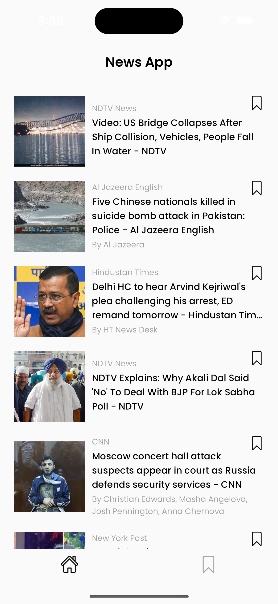
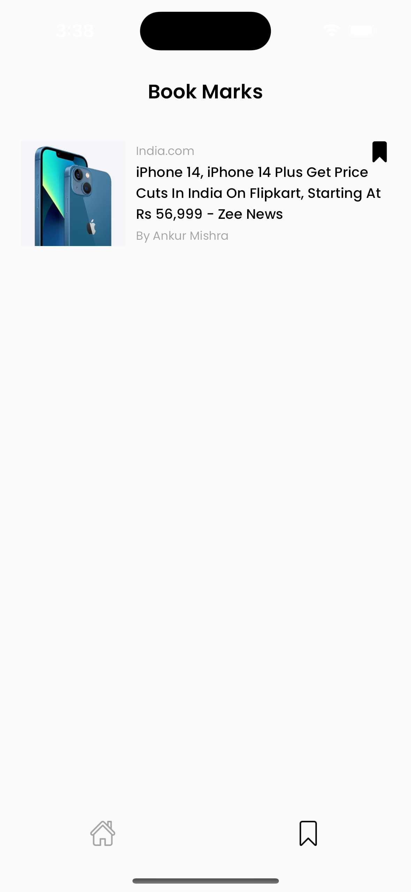
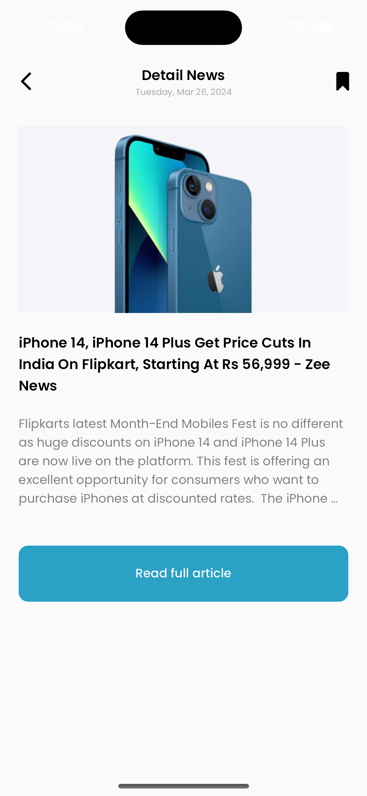
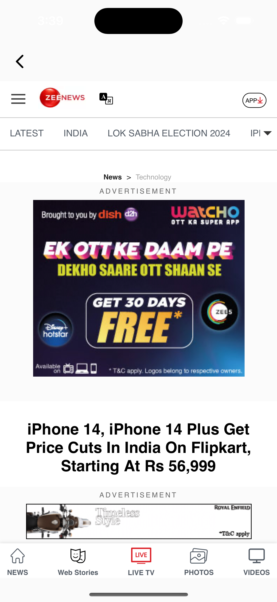

# News Flutter

## Description:
NewsApp is a Flutter application designed to provide users with the latest news headlines, allowing them to read articles in detail, bookmark their favorite articles, and access them later. The app utilizes the News API to fetch news data and employs various technologies such as BLoC for state management, Clean Architecture for code organization, Hive for local data storage of bookmarks, and Chopper for handling RESTful API operations.

## Features:
1. **Latest Headlines:** Users can view the latest news headlines fetched from the News API.
2. **News Detail View:** Users can click on a headline to view the detailed article.
3. **Bookmarks:** Users can bookmark their favorite articles for later access.
4. **Add/Remove Bookmarks:** Users can add or remove articles from their bookmarks.
5. **Read Full Article:** Users can read the full article within the app.

## Technologies Used:
- **Flutter:** A cross-platform UI toolkit for building natively compiled applications.
- **BLoC (Business Logic Component):** A state management library for Flutter applications.
- **Clean Architecture:** A software design philosophy for organizing code in a modular and scalable manner.
- **Hive:** A lightweight and fast key-value database for Flutter, used for storing bookmarks locally.
- **Chopper:** A library for handling RESTful API operations in Flutter applications.
- **News API:** A service that provides news headlines and articles from various sources.

## Credits:
- [Flutter](https://flutter.dev/)
- [BLoC Library](https://bloclibrary.dev/)
- [Hive Database](https://pub.dev/packages/hive)
- [Chopper](https://pub.dev/packages/chopper)
- [News API](http://newsapi.org)

You can download the apk from the [link](https://drive.google.com/file/d/1XBs7tkbSCaZb83DtENwaEv4Kt5hj9_EG/view?usp=sharing)

## Screen shots
   
